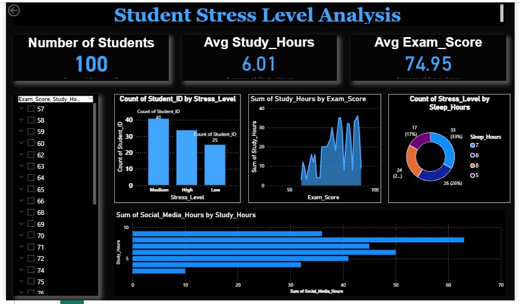

#  Student Stress Level Analysis using Power BI

##  Project Overview
This project analyzes student stress levels using an interactive Power BI dashboard. It provides insights into student stress based on study hours, exam scores, sleep hours, and social media usage.

##  Tools Used
- Power BI
- Power Query
- DAX
- Microsoft Excel / CSV

## 📂 Dashboard Features
- Total Number of Students
- Average Study Hours
- Average Exam Score
- Student Count by Stress Level
- Study Hours by Exam Score
- Stress Level by Sleep Hours
- Social Media Hours by Study Hours
- Interactive Slicers and Filters

##  Skills Demonstrated
- Data Cleaning
- Data Transformation
- Data Visualization
- Dashboard Design
- DAX Calculations
- Interactive Reporting

##  Files Included
- Student_Stress_Level_Analysis.pbix
- dashboard.png
- README.md

##  Dashboard Preview

